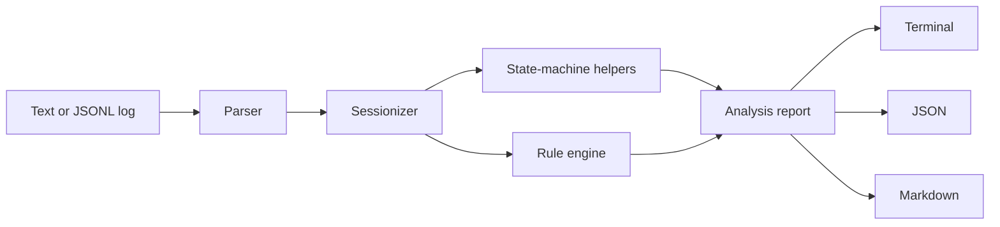

# Telecom Protocol Log Analyzer

`telecom-protocol-log-analyzer` is a Python CLI tool for analyzing simplified 4G/5G protocol troubleshooting logs. It parses RRC, NAS, NGAP, and LTE-style control-plane messages, reconstructs UE timelines, detects common registration/session/RRC/handover failures, and generates recruiter-friendly troubleshooting reports.

This is not a full 3GPP ASN.1 decoder, PCAP decoder, or replacement for commercial tools. It is a practical engineering portfolio project that demonstrates how wireless support, modem/RF application, field test, and protocol troubleshooting workflows can be modeled in clean Python.

## Why It Matters

Real telecom troubleshooting is rarely about one line in isolation. Engineers correlate UE messages, gNB/RAN signaling, AMF/SMF behavior, cause codes, retries, and timing. This project models that workflow with simplified logs so the analysis is easy to run locally while still showing realistic protocol thinking.

Supported protocol layers:

- RRC: setup, reconfiguration, release, radio link failure
- NAS: 5G registration, authentication, security mode, PDU session establishment
- NGAP: initial UE message, NAS transport, context setup, PDU resource setup, handover
- LTE-style concepts can be represented with the same simplified key-value format

Detected failure families:

- 5G registration failures: missing authentication, authentication failure, security mode reject, registration reject, missing registration accept
- PDU session setup failures: NAS SM reject, NGAP resource setup failure, missing N2/NAS correlation, missing session accept
- RRC failures: setup response timeout, setup complete missing, reconfiguration failure, radio link failure
- Handover issues: preparation ACK missing, execution completion missing, handover failure cause, execution timeout
- Initial access style problems: repeated access attempts and reject-cause driven retry patterns

## Architecture



## Example Input

```text
2026-06-01T10:15:01.120Z | UE=IMSI001010123456789 | CELL=NR-101 | LAYER=RRC | DIR=UE_TO_GNB | MSG=RRCSetupRequest | CAUSE=mo-Signalling
2026-06-01T10:15:01.180Z | UE=IMSI001010123456789 | CELL=NR-101 | LAYER=RRC | DIR=GNB_TO_UE | MSG=RRCSetup
2026-06-01T10:15:01.250Z | UE=IMSI001010123456789 | CELL=NR-101 | LAYER=RRC | DIR=UE_TO_GNB | MSG=RRCSetupComplete
2026-06-01T10:15:01.400Z | UE=IMSI001010123456789 | CELL=NR-101 | LAYER=NAS | DIR=UE_TO_AMF | MSG=RegistrationRequest
```

## Development Setup With uv

This project uses `uv` as the recommended development workflow.

```bash
uv sync --extra dev
uv run ruff check .
uv run ruff format --check .
uv run mypy src
uv run pytest -v
uv run coverage run -m pytest
uv run coverage report
```

Run the analyzer:

```bash
uv run python -m telecom_log_analyzer analyze data/samples/registration_auth_failure.log
```

Standard pip editable installation is still possible, but uv is recommended for reproducible local development and CI:

```bash
python -m pip install -e ".[dev]"
```

## Usage

Analyze one file:

```bash
python -m telecom_log_analyzer analyze data/samples/registration_auth_failure.log
```

Analyze all samples:

```bash
python -m telecom_log_analyzer analyze-dir data/samples
```

Export Markdown:

```bash
python -m telecom_log_analyzer export data/samples/handover_failure_target_cell_unavailable.log \
  --format markdown \
  --output reports/handover_failure.md
```

Export JSON:

```bash
python -m telecom_log_analyzer export data/samples/pdu_session_resource_setup_failure.log \
  --format json \
  --output reports/pdu_failure.json
```

Validate a log:

```bash
python -m telecom_log_analyzer validate-log data/samples/normal_5g_registration.log
```

Explain a message:

```bash
python -m telecom_log_analyzer explain-message RegistrationReject
```

Generate synthetic logs:

```bash
python -m telecom_log_analyzer generate --scenario registration_auth_failure --ues 5 --output generated.log
```

## Example Output

```text
Detected Issues
Severity | Issue                                  | Session             | Layer
---------+----------------------------------------+---------------------+------
HIGH     | 5G_REGISTRATION_AUTHENTICATION_FAILURE | IMSI001010999000001 | NAS

Root cause: UE IMSI001010999000001 returned AuthenticationFailure after NAS authentication.
This commonly points to USIM authentication vector mismatch, wrong key material in AUSF/UDM/HSS,
SQN resynchronization problems, or modem-side USIM access errors.
```

## Sample Scenarios

The repository includes realistic simplified traces under `data/samples/`:

- `normal_5g_registration.log`
- `registration_auth_failure.log`
- `registration_reject_roaming_not_allowed.log`
- `pdu_session_setup_success.log`
- `pdu_session_resource_setup_failure.log`
- `rrc_setup_timeout.log`
- `rrc_reconfiguration_failure.log`
- `handover_success.log`
- `handover_failure_target_cell_unavailable.log`
- `multi_ue_mixed_failures.log`

## Development Commands

```bash
uv run ruff check .
uv run ruff format --check .
uv run mypy src
uv run pytest -v
uv run coverage run -m pytest
uv run coverage report
```

## Project Structure

```text
src/telecom_log_analyzer/
  parser.py              # text and JSONL parser
  sessionizer.py         # UE timeline reconstruction
  state_machines.py      # simplified ordered flow checks reported alongside issues
  rules.py               # telecom failure detection logic
  analyzer.py            # orchestration
  report.py              # terminal, JSON, Markdown rendering
  protocol_reference.py  # message explanations
  cli.py                 # argparse CLI
```

## Relevance To Telecom Roles

This project is designed to demonstrate skills useful for:

- Wireless Support Engineer: clear incident-style reports and root-cause hypotheses
- 4G/5G RAN/Core Troubleshooting Engineer: RRC, NAS, NGAP timeline correlation
- Modem/RF Application Engineer: UE-side failure interpretation and suggested trace checks
- Field Test Engineer: repeatable sample scenarios and CLI validation
- Protocol Test Engineer: deterministic rules, state-machine thinking, and test coverage
- Network Integration / Support Engineer: actionable next steps across gNB, AMF, SMF, UPF, and subscriber provisioning

## Limitations

- Uses simplified key-value and JSONL logs inspired by real troubleshooting flows.
- Does not decode ASN.1, NAS binary payloads, PCAP files, or vendor proprietary trace formats.
- Does not claim full 3GPP compliance.
- Cause explanations are practical heuristics and should be correlated with network counters and vendor logs.
- Intended for portfolio, learning, troubleshooting workflow demonstration, and lightweight log triage.

## Future Improvements

- PCAP/packet-decoder adapter layer for decoded Wireshark JSON.
- More detailed 4G S1AP/X2AP attach and handover state machines.
- Timer profiles per vendor/test campaign.
- Correlation IDs for N1/N2/N11/N3 troubleshooting across AMF, SMF, UPF, and gNB logs.
- HTML report output and trend summaries across field-test batches.
